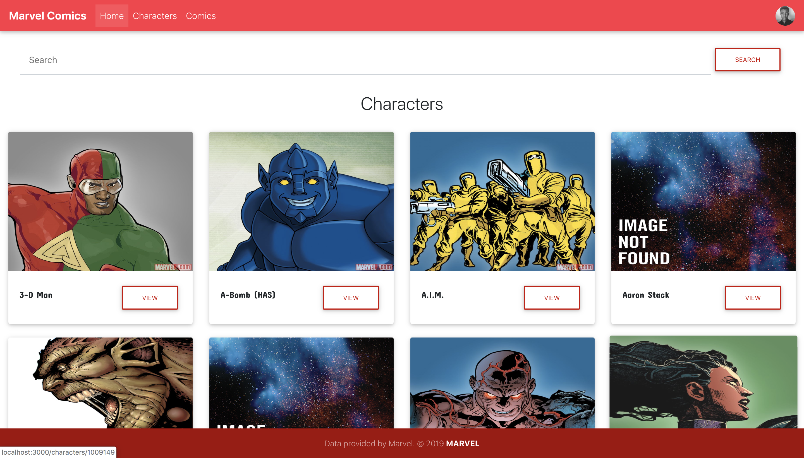

# Marvel-Comics

Progressive Web Application that displays information about Marvel Comics and Characters.

<code><h3>Link to application can be found <a href="https://marvel-comic-characters.netlify.com/">here</a></h3></code>

### Table Of Contents

- <a href="#built-with">Built With</a>
- <a href="#getting-started">Getting Started</a>
- <a href="#license">License</a>
   
   

## Built With

<ul>
<li><a href="https://reactjs.org/">React</a></li>
<li><a href="https://developer.marvel.com/">Marvel API</a></li>
<li><a href="https://developer.marvel.com/">Material Design Bootstrap</a></li>
<li><a href="https://www.styled-components.com">Styled Components</a></li>
</ul>

## Getting Started

<h3>Prerequisites</h3>
You need Nodejs Installed to be able to run this project on your machine.

<h3>Installing<h3>
<ul><li>Clone Repository</li></ul>
<pre><code>git clone https://github.com/Easybuoy/marvel-comics</code> </pre>
 

<ul><li>Change Directory To Marvel Comics</li></ul>
<pre><code>cd marvel-comics</code></pre>
 

<ul><li>Install Dependencies</li></ul>
<pre><code>npm install</code></pre>
 

<ul><li>Start Application</li></ul>
<pre><code>npm run start</code></pre>
 

## License

<h4>This project makes use of the MIT License which can be found <a href="https://github.com/Easybuoy/marvel-comics/blob/develop/LICENSE">here</a></h4>
